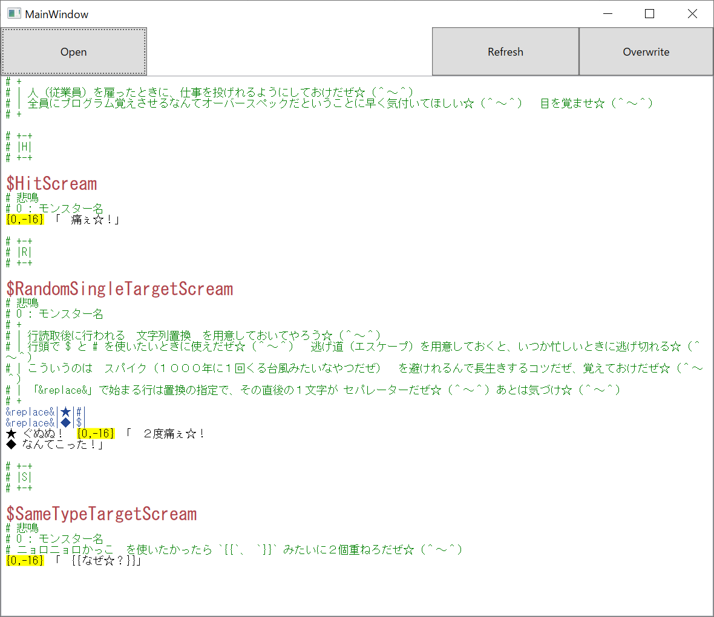
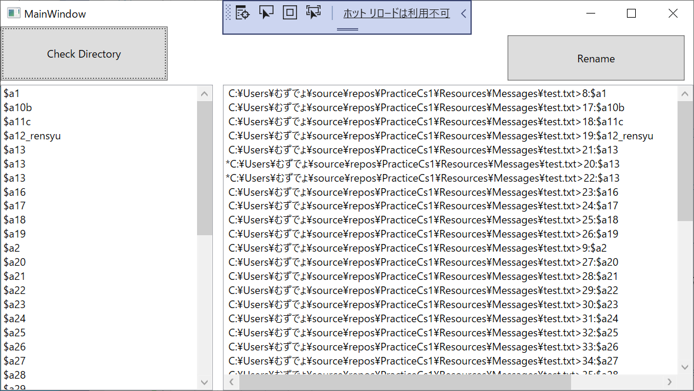

# Practice C# 1

これはゲームの練習プログラムだぜ☆（＾～＾）

# Support tool
絵を見て分かれだぜ☆（＾～＾）  

  
[game-message-editor](https://github.com/muzudho/game-message-editor)  
↑これがゲーム・メッセージ・エディターだぜ☆（＾～＾）  

  
[game-message-id-checker](https://github.com/muzudho/game-message-id-checker)  
↑IDの重複とリネームは　お任せあれ☆（＾～＾）！  

# Blog

[リッチ・テキスト・ボックスって何だぜ☆（＾～＾）？](https://crieit.net/posts/64b8e6424d4c223c398ba44f80b76ea6)
